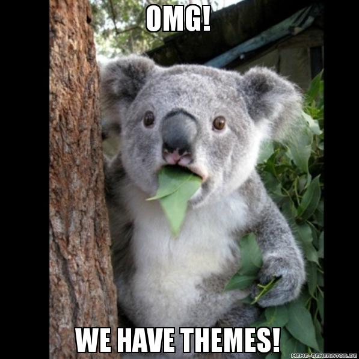

###Updating to a newer version:

* clone the [kwf-upgrade](https://github.com/koala-framework/kwf-upgrade) repository (contains helper scripts that will upgrade your codebase)
* execute composer install in kwf-upgrade
* execute all update scripts, eg to update from 3.3 to 3.5 you need to call `upgrade-to-3.4.php` and `upgrade-to-3.5.php`
* execute `composer update`, `php bootstrap.php clear-cache` and `php bootstrap.php` build and fix any errors you get
* execute `php bootstrap.php update` to execute update scripts that update the database

#5.0

(upcoming)

####New Features:
* webpack build

####Possibly incompatible Changes:

* default ContentSender now writes best practice security headers

#4.5
(upcoming)
####New Features:
* kwcClass (without dot) is now also supported

#4.4

####New Features:

* maintenance jobs log output
    * logs run jobs in database (can be viewed in browser as admin)
    * send failed jobs output to config setting `maintenanceJobs.failNotificationRecipien` or `Job::getRecipientsForFailNotification()`

####Possibly incompatible Changes:

* Security: restricted media uploads to mimeType, extension and size, by default only admin and superuser can upload files 
* (*) `Kwc_Advanced_VideoPlayer_Component` and `Kwc_Advanced_AudioPlayer_Component` moved to own repository: `koala-framework/kwc-mediaelement`

#4.3

####New Features:
* better varnish integration: assets in apc can be disabled, possible to clear fullpage cache (kwf-varnish 1.1)
* Newsletter: possible to add a "web version" link that opens newsletter in browser
* `Kwc_Tabs_Component` now supports internal and external linking to any given tabId by using a URL hash. Internal links can be made by using the anchor function (as already used for headers) in the backend. Also added a `Kwc_Legacy_Tabs_Component` to support older implementations.

####Possibly incompatible Changes:

* Kwc_Mail (and Newsletter) redirects changed
    * has to be page now, otherwise components where it used could throw NotFound exception
    * `*redirect*` prefix in links dropped
    * `*showcomponent*` removed, use `passMailRecipient` flag to access recipient, and this components has to be a page now
* `Directory_List_View_Component::getItems`/`getItemIds` moved to `Directory_List_Component`
* Disable legacy support for assets packages to prevent cssChunks issues

#4.2

####New Features:

* node-sass updated to 3.7
* needed for kwf-extjs 3
* modelProviders config.ini setting
* eventSubscribers config.ini setting
* Kwc_Menu_Mobile_Component is now animated using CSS instead of javascript, animations triggered by on('menuToggle') should now also be done in CSS without using the deprecated parameter "slideDuration"
* assets are now also loaded from npm packages (before only bower)
* Add possibility to inehrit master template including styles (`masterExtends` setting to inherit styles, `renderer.getComponentMasterTemplate` for inheriting twig template)
* Admin js is now loaded deferred, Kwf.main is called as entry point to start the application
* `kwf/base-url` for JavaScript that outputs relative urls (required for IntegratorTemplate)
* [BETA] Symfony integration: new KwfBundle for creating REST APIs
* X_KWF_AUTHORIZATION as alternative for default Authorization-Header (for Mobile-Apps working with OAuth and preLogin required)
* Event-classes can now listen to multiple events when setting `events` to an array of events
* `kwfLocal` selector for js/css that gets replaced with class named after file (similar to `kwcClass` but also usable outside of components)

####New Features available as package:

* [kwf-varnish](https://github.com/koala-framework/kwf-varnish) for integrating a varnish cache
* [kwf-reactjs](https://github.com/koala-framework/kwf-reactjs) for using ReactJS in Components

####Possibly incompatible Changes:

* E_STRICT error_reporting is now enabled *(!)*
* (*) getTemplateVars now always needs a renderer argument (for compatibility with E_STRICT)
* (*) getSettings now always needs a parameter (usually null) (for compatibility with E_STRICT)
* Components now can't set $needsParentComponentClass anymore
    * SwitchDisplay, Tabs and Legacy_Columns now create a Kwc_Paragraphs_Component (previosuly created their parent)
* (*) vendor/koala-framework/koala-framework/node_modules folder is moved to web (./node_modules)
* Kwf.sessionToken isn't set anymore, `kwf/user/fetch-session-token` get it using if needed
* Cacheable content in frontend is now output with Cache-Control: public

####Components converted to [BEM](../styling/general/bem/) classes, possibly incompatible when uniquePrefix is used:
* `Kwc_Menu_Dropdown_Component` (hasSubMenu class)

To update a web to this branch execute the following command in the working directory of your web:

    php ../kwf-upgrade/upgrade-to-4.2.php
    
This will update required changed marked with (*).

#4.1

####New Features:

* postcss filters: autoprefixer and others for optimizing css file size (usage of compass mixins for vendor prefixes not required anymore)
* improved build performance, repeated build with multiple languages generated packages now much faster (initial build is slower though)
* frontend performance: less css/js to load due to multiple asset packages for components (assetsPackage flag)
* integration of babeljs for es6 support (add "use es6"; at beginning of js file)
* config setting: [server.preliminaryDomain](../kwc-cms/domain-configurations.md) (instead of noRedirectPattern)
* googleMapsApiKey config setting for a single key that works on all domains (use instead of googleMapsApiKeys.examplecom

####Possibly incompatible Changes:

* refactored CookieOpt and Statistics
* Kwf_Component_Plugin_Interface_SkipProcessInput changed
* Statistics_OptBox div structure and class names

####Components converted to [BEM](../styling/general/bem/) classes, possibly incompatible when uniquePrefix is used:
* `Kwc_News_List_View_Component`

To update a web to this branch execute the following command in the working directory of your web:

    php ../kwf-upgrade/upgrade-to-4.1.php

This will update required changed marked with (*).

#4.0

####New Features:

* Kwf.Util.ResponsiveEl can now be used as sass mixin: @include el-breakpoint(350px) { }
* `application.uniquePrefix` config setting will prefix all generated html classes and scope all javascript into window.uniquePrefix
* `kwfUp-` in html, css and js will be replaced with` application.uniquePrefix`
* when uniquePrefix is activated, [BEM (Block Element Modifier)](../styling/general/bem/) standard should be used for naming classes
* Component.override.scss/js: stops styling from getting inherited from base component
* Components now support Layout Contexts (for usage with kwc-susy instead of ResponsiveEl)
* support for *.underscore.tpl dependencies

####New Features available as package:

* [kwc-susy](https://github.com/koala-framework/kwc-susy) [susy2, new, preferred method for layouting components](../styling/susy-two-grid-styling/overview) (not just Master)

####Possibly incompatible Changes:

* Component.js now used commonjs to load dependencies
* .printcss doesn't exist anymore, use @media print {} in .(s)css instead
* asset variables (`var(typo)`) don't exist anymore, use sass variables instead (`sass/config/_colors.scss`)
* `*cssClass` template variable renamed to `rootElementClass`
* `*.cssClass` in css/js that gets replaced component css class renamed to `.kwcClass`
* Component css+js inheriting is implemented differently

To update a web to this branch execute the following command in the working directory of your web:

    php ../kwf-upgrade/upgrade-to-4.0.php
    
This will update required changed marked with (*).

#3.11

####New Features:

* Performance improvements for Model_Db (Zend_Db_Table not used anymore)

####Possibly incompatible Changes:

* Lightbox styling & animations re-implemented using css

To update a web to this branch execute the following command in the working directory of your web:

    php ../kwf-upgrade/upgrade-to-3.11.php
    
This will update required changed marked with (*).

#3.10

####New Features:

* SEO improvements:
    * Improved sitemap.xml now with lastmod field
    * title attribute for links
    * title attribute for images
    * auto-generated (transliterated) urls for cyrillic letters
    * history with automatic redirect for renamed pages
    * Don't index ImageEnlarge pages, use the enlarged image as href
    * Avoid double content for Lightbox (load parent content using ajax)
    * add language of current page in html
    * add alternate link to other languages of current page in html
    * use correct title and metatags for Lightbox pages
* added maintenance-jobs, started by process-control

####Possibly incompatible Changes:

* *newsletter is now started by [maintenance-jobs](../kwc-cms/maintenance-jobs.md), own process not required anymore
* *OpenGraph Image is now integrated in MetaTagsContent

To update a web to this branch execute the following command in the working directory of your web:

    php ../kwf-upgrade/upgrade-to-3.10.php
    
This will update required changed marked with (*).

#3.9

####New Features:

* kwf-extjs: file upload field
* on?Element*: selector that matches changed element directly is now supported correctly
* User Auth Redirect: supports auth using SSO (eg. OAuth2)
* *New translation system with po files, no more trl.xml

####Possibly incompatible Changes:

* `Kwc_List_ChildPages_Teaser_Component` now has visiblity, remove `visible` from child component
* Default image size setting in Kwc_Abstract_Image_Component uses cover=false instead of cover=true. So the behaviour accords to versions <3.6 while in 3.6-3.8 the cover=true is accidently used by default.
* update scripts naming changed, now named eg. 20150310Foo.sql
* Upload Model ids changed from INT to uuid VARBINARY(36)
* translation now saved in po files. See [Translation](../kwf-general-features/translation.md) and subpages for more information.

To update a web to this branch execute the following command in the working directory of your web:

    php ../kwf-upgrade/upgrade-to-3.9.php
    
This will update required changed marked with (*).

#3.8

####New Features:

* Koala Framework now has a [required build step](http://www.nikosams.net/blog/14_build_step)
* Koala Framework now uses [composer](https://getcomposer.org/) to manage dependencies, [composer-extra-assets](http://www.nikosams.net/blog/17_composer_npm_bower_assets_installation_using_composer-extra-assets) to require bower and npm dependencies
* Acl Resources can now have an [order setting](../kwf-general-features/acl/backend-menu-order.md)
* new flag "showInLinkInternAdmin" to show static pages in LinkTag Intern Pages
* Performance: Frontend js is now split in two parts where one is loaded deferred, use Component.defer.js and assetsDefer setting to defer JS load.
* Users can now consist of multiple sources (to include eg. a Members model)
* new form styling sass mixins
* Paragraphs Admin: order of components in add menu can be specified using [componentCategory and componentPriority](../kwc-cms/customize-components/component-name.md) setting
* nicer and styleable backend login
* Components: twig templates (optional)
* Components: getMasterTemplateVars: like getTemplateVars but for Master.tpl
* improved password hashing using bcrypt
* automatic build of customized modernizr (kwf-modernizr)
* integration of external javascript libraries thru own package: kwf-extjs, kwf-extensible, kwf-deftjs, kwf-densajs
* clear cache watcher compatible now with osx and windows (with help of python watchdog)

####Possibly incompatible Changes:

* Ext 2.3.0 moved from Ext to Ext2 JavaScript namespace, css from x- to x2-
* Kwf.on*Ready: defaults to defer=true now
* Lightbox, ViewAjax Javascript: converted from Ext2 to jQuery
* `Kwf.Utils.DoubleTapToGo` implementation changed
* Ext4 MVC Controllers redesigned and moved to own repository: [densajs](https://github.com/koala-framework/densajs)
* User Model changes
    * re-implementation of user related classes
    * `locked` was removed
    
To update a web to this branch execute the following command in the working directory of your web:

    php ../kwf-upgrade/upgrade-to-3.8.php
    
This will update required changed marked with (*).

#3.7

####New Features:

* `Kwc_Columns_Component`: Allowed to add unlimited rows which are fully responsive
* Responsive Images: Images are only loaded if visible and with optimized size
* performance improvements for frontend javascript, [new options](../kwc-cms/customize-components/behavior-javascript.md) for onElementReady
* Ext4 MVC Controllers
* Raven Exception Logger ([php](https://github.com/getsentry/raven-php), [js](https://github.com/getsentry/raven-js))
* Benchmark Box for Frontend JavaScript profiling

####Possibly incompatible Changes:

* (*) The following components got renamed:
    * Kwc_Columns_Component -> `Kwc_Legacy_Columns_Component`
    * Kwc_ColumnsResponsive_Component -> Kwc_Columns_Component
* Responsive Images: Use `visibility:hidden` instead of `display:none. `
    If not possible call `Kwf.callOnContentReady(el, {newRender: false});` while image is shown.
* `Kwc_Basic_Image`: useParentImage setting got removed, use Kwc_Basic_ImageParent instead
* media cache doesn't get cleared on clear-cache anymore, use php bootstrap.php clear-cache media to force clear
* onElementReady/onContentReady:
    * scope parameter moved into options
    * form, list and others now get initialized with defer, to access them you also have to defer
    
To update a web to this branch execute the following command in the working directory of your web:

    php ../kwf-upgrade/upgrade-to-3.7.php
    
This will update required changed marked with (*).

#3.6
Created: 2014-01-14

####New Features:

* new assets system
    * Ext4 support (and Extensible)
    * automatic dependencies for Component.js
* `Kwc_Basic_Image`: crop functionality
* new `Kwc_Basic_Headline_Component` that allows selecting the Layer
* Deleted Flag (see the [documentation](../kwf-general-features/models/deleted-flag.md) for details)

####Possibly incompatible Changes:

* Image Settings: "bestfit" changed to cover=false; "crop" changed to cover=true; "deform" is not existing anymore.
* Cover setting in default image size of Kwc_Image_Abstract changed to true - this happened by mistake and is changed back in 3.9
* removed features from assets: sections, http host dependent content, same file in multiple dependencies
* added default acl resources (user admin, clear-cache redirects) (moved from vkwf)
* All Enquiries acl resource moved to Kwc_Form_Dynamic_MenuConfig
* image-dimension definition has changed. There is no bestfit, crop or deform option anymore. Now cover=true/false defines if the defined width and height have to be covered or if the image can be smaller.
* ImageEnlarge: "Alternative preview image" feature got removed (use [this script](https://gist.github.com/Ben-Ho/8005113) to get list of affected components)
* (*) bootstrap.php doesn't contain include paths anymore, moved to config.ini with common defaults in kwf
* (*) The following components moved to legacy:
    * `Kwc_Basic_Headline_Component` -> Kwc_Legacy_Headline_Component
    * `Kwc_Basic_Headlines_Component` -> Kwc_Legacy_Headlines_Component

To update a web to this branch execute the following command in the working directory of your web:

    php ../kwf-upgrade/upgrade-to-3.6.php
    
This will update required changed marked with (*).

#3.5
Created: 2013-09-24

####New Features:

* running web in a subfolder is now supported
* (*) Resource_MenuUrl doesn't require setting a url

####Possibly incompatible Changes:

* (*) assets loader now gets called in setup, remove line from bootstrap.php

To update a web to this branch execute the following command in the working directory of your web:

    php ../kwf-upgrade/upgrade-to-3.5.php

This will update required changed marked with (*).

#3.4
Created: 2013-07-31
Stable: 2013-08-13

####New Features:

* Themes (omg!)

* responsive lightbox
* improved usability for Paragraphs admin
* controllers directory in web includes all subfolders now dynamically, if you update an older web you can delete the lines in bootstrap.php where you include these (frontController)
* Automatic protection against CSRF attacks for all json requests
* full https support in frontend (automatic switch to https if session or form is used)
* better jQuery support in frontend (`onJElementReady`)
* fullPage cache should improve frontend performance
* Facebook Login
* Web Installer
* submit button caption of Kwc_Form_Dynamic can be customized in backend
* Opt-Component for Cookie Opt-In/-Out (At the moment only statistic components follow these settings)

####Possibly incompatible Changes:

* `Kwc_Mail_Editable_Admin` does not exist anymore, use `Kwc_Mail_Editable_MenuConfig`
* Form default styling (especially buttons) removed
* Change user logout in frontend from ?logout to fixed url /kwf/user/logout
* `Kwc_User_BoxAbstract_Component` does not exist anymore (loggin in / out is processed independently of components, so there is no need to have a `User_BoxAbstract` anymore)
* `Kwf_Component_Plugin_Login_Component` does not extend `Password_Plugin` anymore (should be no problem but please test)
* added `Kwf_Session`, Kwf_Session_Namespace, must be used instead of Zend_Session*
* `KwfOnReady` dependency: required for Kwf.onElementReady and Kwf.onContentReady
* (*) new includeCode helper that should be used in Master.tpl instead of other header/footer codes (title, metatags, statistics etc)
* (*) The following components refactored and moved to list:
    * `Kwc_Composite_Links_Component` -> Kwc_List_Links_Component
    * `Kwc_Composite_Downloads_Component` -> `Kwc_List_Downloads_Component`
    * `Kwc_Composite_LinksImages_Component` -> `Kwc_List_ImagesLinks_Component`
    * `Kwc_Composite_Image_Component` -> Kwc_List_Images_Component
* `Kwc_List_Images_Component` uses EnlargeTag as default, not LinkTag anymore. If you need LinkTag, please extend Kwc_List_ImagesLinked_Component
* Navigation-Buttons in ImageEnlarge are not shown anymore when a parent component is LinkTag (due to cache deletion problems)

* Acl:
    * acl gets cached, don't do any dynamic stuff in acl!
    * acl resources based on components need to clear cache on changes
    * (*) acl resources with menuConfig need to use trlStatic for translated text
    * Auto* actions: hide buttons & permissions based on privilege
* `Kwc_Mail_Abstract_Component` doesn't disable viewCache anymore
* (*) Css files changed:
    * css/master.css -> merged into css/web.css
    * css/web.css -> component/Root/Web.css and Master.css (Master.css should contain styling for Master.tpl)
    * Master.tpl contains cssClass which can also be used in Master.css
* Settings "hasDomain", "hasLanguage" and "hasMoneyFormat" have been replaced by baseProperties
    * Remove mentioned settings and associated Methods like "getLanguage" or "getDomain"
    * Add flag "hasBaseProperties"
    * Optionally add setting "baseProperties" which returns array of supported properties (e.g. "language", "domain")
    * Override getBaseProperty($propertyName) and return the appropriate value for $propertyName
* (*) The settings for statistic have been renamed to statistics and follow the baseProperty mechanism.
    * (*) statistic.analyticsCode -> statistics.analytics.code
    * (*) statistic.piwikId/piwikDomain -> statistics.piwik.id/domain
    
To update a web to this branch execute the following command in the working directory of your web:

    php ../kwf-upgrade/upgrade-to-3.4.php

This will update required changed marked with (*).

#3.3
Created: 14.03.13

Stable: 16.04.13

####New Features:

* `Kwf.Fade.Elements` now uses a customizable `Ext.XTemplate` for generated links
* `Cache_SimpleStatic`: used for static caches
* Non-Static caches now save to memcache instead of apc which fixes possible problems with apc fragmentation and apc deadlocks
* Custom Session Handler that stores into memache + mysql
* SASS scss is now supported
* Responsive Components: ColumnsResponsive
* new preview in admin including responsive preview
* TitleEditable inherits from subroot

####Possibly incompatible Changes:

* Forms enable view cache by default, if you load dynamic data disable it again
* Shop_Cart_OrderData moved into Shop_Cart_Order
* Master.tpl: div with componentWidth not created anymore in the componentWithMaster function, add back to template

#3.2
Created: 14.05.12

Stable: 21.12.12

####New Features:

* Trl works again (clearing view cache)
* clear-cache-watcher
* Kwc_Abstract_Image: support retina display quality
* AjaxView including live search and endless scrolling
* jQuery dependency
* jQuery-based video & audio player

Possibly incompatible Changes:

* Master.tpl: div with componentWidth is now created in the componentWithMaster function, delete it from template (obsolete in 3.3!)
* lightbox now adds closeButton automatically
* Events now use `Component_Data` objects instead of just ids. Most Events in webs must be adjusted.
* FulltextSearch is implemented differently and needs to be restyled
* `Kwf_Component_Plugin_Interface_View` got replaced by other interfaces

#PREVIOUS VERSIONS

###(not supported anymore)

#3.1
Created: 7.12.11

Stable: 14.05.12

####New Features:

- Lightbox and ListSwitch make use of HTML5 history API

- solr search

- Expr_Position

- default assetVariables in kwf/config

####Possibly incompatible Changes:

- Kwc_Basic_Empty_Component renamed into Kwc_Basic_None_Component

- Kwc_Mail now uses master.css styles and creates inline css styles

- mail: getMailVars is replaced by getTemplateVars($renderer)

- mail: adding images as attachment not possible anymore

- FrontendForm errors changed: config setting kwc.form.errorStyle has 'bubble' as default

- List_Gallery has fixed aspectRation 3/4 by default

- Kwc_Abstract::modifyFulltextDocument got replaced by Kwc_Abstract::getFulltextContent

- default webForm styles moved into kwf, remove them in web.css

- componentLink Helper only allows Component as target, otherwise use link Helper

#3.0
Created: 21.06.11

Stable: 7.12.11

####New Features:

- Model_RowCache: cached angegebene columns von rows im apc cache wenn per getRow() gesucht wird

- Komponentenbreite dynamisch ermitteln: Master.tpl: $this->componentWidth($this->data)

                                         Root Settings: contentWidth, contentWidthBoxSubtract

                                         Component Settings: contentWidhtSubtract

- CLI-Update Controller kann man jetzt --class angeben:

  führt auch SQL-Dateien aus, Beispiel: "vps update --class=Vpc_Abstract_Cards_Update_2"

- Vpc_Abstract_Cards: Unterkomponente per Cards aus wählen, LinkTag basiert jetzt auf dieser

    Komponente

- new Generator_Box_StaticSelect: allows the user to select from different components

                                  this can replace InheritContent in combination with

                                  Vpc_Basic_ParentContent_Component

                                  (it's more powerful and logical)

- Component.yml: instead of creating Component.php it is possible to create Component.yml for easier creating

    custom components

- childSettings: Components can change the settings of their children without inheriting

- Vpc_Menu_EditableItems: allows attach components to menu items (including images)

- It's now possible to have any content in a lightbox and still have an unique url

- ListSwitch items have their own url and lazy loads content

- Directories: Month/Category links now automatically show the number of items in componentLinks

- There can be multiple Newsletter components, but only one per subroot

     Subscribers and categories will be per newsletter component

####Possibly incompatible Changes:

- User_Box: aufgeteilt in zwei komponenten, wenn eingeloggt LoggedIn Unterkomponente

- breite von innerContent, TwoColumns u.a. *nicht* mehr im css einstellen, sondern in Komponenten Settings

     Fixe Breiteneinstellungen gehören generell nicht mehr ins css

- Vps_User_Model is not a service model, that changed to Vps_User_Service_Model

- Vpc/List/Switch got completely changed

- Menu: maxLevel setting removed (create own SubMenu component with different level)

- Vpc_Abstract::sendContent moved to ContentSender class

- ImageEnlarge changed a lot: JS Template got replaced by normal Component.tpl, HTML Layout changed a bit

- componentLink helper: parameters $get and $anchor got removed, 3rd parameter now is a config array

- Admin::_addResourcesBySameClass got replaced by menuConfig setting

- Kwc_Directories_List_Component: method getItemDirectoryClasses must be implemented

    and staticall return all possible directory componentClasses

###handled by vkwf/scripts/koalarize-rename-web update script:

- Vps and Vpc renamed into Kwf and Kwc

- application/* moved into web root

- application/config.ini dependencies section moved into dependencies.ini

#2.1
Erstellt: 21.06.11

Stable: 21.06.11

###Neue Features

- MultiCheckbox in Dynamischen Formularen

####Possibly incompatible Changes:

#2.0
Created: 20.12.10

Stable: 03.03.11

###Neue Features

- RTE mit tinymce unterstützung

- Component Cache Neu, Url Cache, ProcessInput Cache

- HtmlEditor: enableBlocks setting gibts nicht mehr, wurde in FormatBlock plugin ausgelagert und

    müsste manuell zu plugins hinzugefügt werden (bevorzugt wird Text-Komponente!)

- simple /sitemap.xml, ohne änderungsdatum (bei Komponentenweb immer aktiv)

- /robots.txt (bei Komponentenweb immer aktiv)

####Possibly incompatible Changes:

- Helper: Statt $this->ifHasContent($component) muss man if ($this->hasContent($component)) schreiben

- partials view Helper: 2. Parameter (partialClass) wurde entfernt

- Master.tpl muss $this->componentWithMaster($this->componentWithMaster) für die Haupt-Komponente verwenden

- generators: box priority wurde entfernt

- Image Resizing: exif drehung wird jetzt berücksichtigt

- Config section 'preview' has to have server.domain set to use a real preview domain

#1.11
Erstellt: 17.08.10

Stable: 03.03.11

####New Features:

- Vps_Date, Vps_DateTime

- CopyContent

- editComponents geht jetzt auch mit Table Generator

- MultiCheckbox: Alle / keine Links (standardmäßig aktiv)

- Volltextsuche

- Model_Mongo

- Model_MirrorCacheSimple

- AccessByMail Plugin

- (Multi)-FileUpload per html5 wenn moeglich, incl drag&drop support

- Doppeltes bearbeiten von zB Directories ist mittels extConfigControllerIndex deaktivierbar

####Possibly incompatible Changes:

- Vps_Date ist komplett inkompatibel (erbt nicht mehr von Zend_Date)

- Expr_Smaller -> Expr_Lower

- Expr_SmallerDate, Expr_HigherDate -> entfernt; Expr_Smaller kann dafür auch mit

    Vps_Date und Vps_DateTime umgehen

- Expr_Equal (Equals ist deprected)

- Menü-Komponenten: TemplateVars wurden geändert, ist jetzt ein array. Alle überschriebenen

    Templates müssen angepasst werden (bzw. schaun obs wirklich überschrieben werden muss)

- frontControllerClass MUSS in application/config.ini angegeben werden

- Tags in Seitenbaum gibts nicht mehr (kein Vps_Component_Acl->allowTag())

- aclClass MUSS in application/config.ini angegeben werden

- Columns admin ist jetzt keine Form mehr sondern ein Grid

- .webStandard strong/em/ol/ul/li ist jetzt im vps und sollte in webs entfernt werden

- newsListView und eventsListView Teaser haben jetzt ein nl2br

- showInPageTreeAdmin flag gibts nicht mehr, ist jetzt nur noch ein generatorFlag

- Image Dimensionen: wenn width oder height 0 ist muss 'deform' verwendet werden

- Neue tdpdf-Version (5.9.023). PDFs gehören auf jeden Fall überprüft

#1.10
Created: 09.06.10

Stable: 16.08.10

####New Features:

- Generator Plugins

- Generator Plugin: Tags

- Kaltstart Performance

- Vpc_Form: vpsFieldError klasse wird für Felder mit Validierungs-Fehler gesetzt

- needsParentComponentClass Setting, damit wird die $parentComponentClass bei getSettings

    übergeben

- ExtConfig ist eigene Klasse - statt Admin::getExtConfig, setzen über extConfig Setting

- Vpc_List_Switch hat transitions (fade ist jetzt standard) und die weiter-pfeile

    funktionieren über das ende hinaus und fangen wieder von vorn an

- Directory Administration: es gibt jetzt ExtConfigTabs

- Neues EyeCandy: Vps.Switch.Overlay

- Administrierbare Redirects

####Possibly incompatible Changes:

- editComponents werden im Seitenbaum nur mehr berücksichtigt wenn direkt unter der bearbeitenden Komponente liegen

    (indirekt nur wenn der ganze Pfad editComponents eingestellt hat)

- Directories Administration: 
    - Admin::_getContentClass gibts nicht mehr

    - idTemplate muss nicht mehr gesetzt werden

- editComponents werden auch bei Paragraphs berücksichtigt

- Vpc_Basic_Flash_Component gibts nicht mehr, stattdessen Flash_Code und Flash_Upload

    Vpc_Basic_Flash_Component mit Upload (nicht Url) wird nicht autom. konvertiert

- Form_Field::validate gibt jetzt nicht nur mehr ein array mit Validierungsmessages zurueck sondern

    ein array mit field und message

- Vpc_Columns::getSettings beöntigt $parentComponentClass Argument, muss bei abgeleiteten

    durchgeschliffen werden

- Vpc_List_Switch hat options, müssen im Template ausgegeben werden

- Admin::getExtConfig gibts nicht mehr, durch extConfig Setting ersetzen

- Vpc_Abstract_List_*Admin und Vpc_Abstract_Composite_*Admin gibts nicht mehr, stattdessen

    sollte die passende extConfig Einstellung gesetzt werden

- Update auf Zend 1.10.7

#1.9
Created: 07.05.10

Stable: 09.06.10

####New Features:

- AutoFilter

- Vpc_Tabs

- Vpc_List: Multi File Upload

####Possibly incompatible Changes:

- LightBox restyling

- News und Events View Html verbessert Vps

- NewsCategories Detail im Vps das die Kategorien ausgibt

- Vpc_Columns erben von Abstract_List

    - TemplateVars: columns umbenannt in listItems

    - generator columns umbenannt in child

- Directories Kategorien sind jetzt pro Komponente

    - eigene Tabelle, kein Pool mehr

    - Updatescript gibts für News und Events

- Vps_Component_Plugin_Password_Component::isLoggedId in isLoggedIn umbenannt

- config->vpc->childComponents wird direkt in getSetting verwendet und

       nicht mehr druebergespielt, ist flexibler (commit cf4a0a2)

- Newsletter:

    - Strukturänderungen

    - Standardmodel von Users auf Subscribers umgestellt

    - auf jeden Fall alles durchtesten beim Umstellen

#1.8
Created: 15.01.10

Stable: 20.05.10

####Bugfixes:

- RTE einfügen

####Änderungen:

- List_Fade kann Text-Balken ausblenden wenn nix drin is

