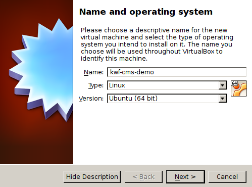
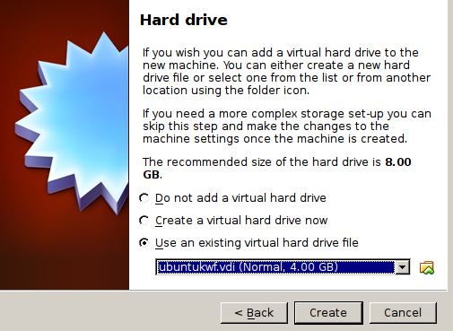
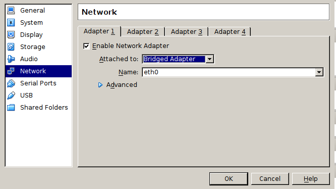
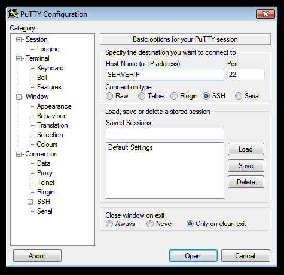
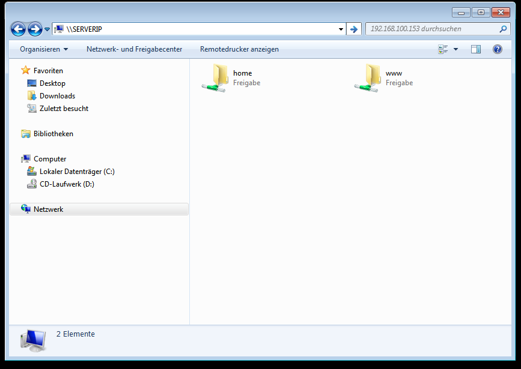

#INSTALL USING OUR VIRTUAL MACHINE

We prepared a Virtual Box vm with ubuntu and a full configured koala web framework and the cms-web-demo.
Using this vm is the recommended way of developing a kwf-web with windows.

##Requirements

* Virtual Box 4.3 or higher
* ssh client (putty on windows, optional)

##Installation

1. Make sure you have virtualization technology enabled in your bios. You can see how to do so here.
2. Download the virtual machine
3. Unzip the file
4. In Virtual Box - create a new virtual machine
    * Choose Ubuntu (64bit)
    * Use ubuntukwf.vdi image
    * create a network bridge (to be able to access the vm from your host)
    
    

1. * Use ubuntukwf.vdi image

1. * create a network bridge (to be able to access the vm from your host)

##Login

###SSH User

username: kwf
password: password

###MySQL

username: root
password: koala

###CMS Admin http://SERVERIP/admin

username: demo@koala-framework.org
password: demo

###Samba user

username: kwf
password: password

##Usage (for Windows)

For a nice workflow, we want to use putty for the command line work and our windows browser for displaying, so we don't have to work within our vm.

Accessing the document root can be done by mounting the exported smb share.
Make shure to login in with the correct smb user (login above).

###To see the website in your browser simply use http://SERVERIP

##Troubleshooting

**My virtual machine does not boot!**

One solution can be to enable virtualization technology in your bios. You can see how to do so [here](http://www.sysprobs.com/disable-enable-virtualization-technology-bios).

