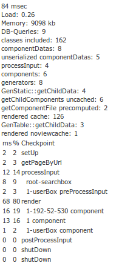

#BENCHMARK BOX

The benchmark box is used to show information about the process of creating a complete web-page. 
It contains data about database, execution-time and the different components connected to the page.

##Enable Benchmark Box

At first you have to add your ip because not everybody should be able to check how your web performs. 
Just add `debug.benchmarkActivatorIp.INDEX = IP` to `config.ini`.
Then it's possible to add `KWF_BENCHMARK` to the parameter of your url or add `debug.benchmark = true` to your config.ini-section to ensure to have the 
information on every page. (This could be a little bit annoying when styling, but necessary when developing features for a web)

#Benchmark Box Data

First information is the time to execute php for this request.      

Load tells the load of the server.

Memory is the amount of memory allocated for this request.

When it's possible to reduce DB-Queries to zero even the database connection is left out.

After "ms % Checkpoint" comes information about time related to components respectively function-calls. 
This is interesting to find time consuming components and helps to optimize the bottleneck of the page load.

