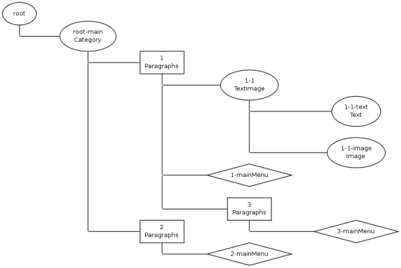

#COMPONENT IDS

Each component id has it's own unique id, you can get it using `$data->componentId` and query by component id using 
`Kwf_Component_Data_Root::getInstance()->getComponentById($id)`.

Those ids are hierarchical, meaning each level in the tree will add an additional separated by `'-'` or ` '_'`:

* `root`
* `root-foo`
* `root-foo_bar`
* `root-foo_bar-xx`

`'_'` separator means page child component

`'-'` separator means any other child component (plain, box, pseudo page)

##Page Ids

There is however one exception: pages as created in the site tree admin (and stored in kwf_pages) start from scratch! 
That means the component id of such a page is eg. just '123'.

In the example above you see that page 1, 2 and 3 all start their id from scratch even though 3 is below 1.

###Why this exception?

* It shortens most ids
* it makes it possible to move page to another page without changing it's id

##Expanded Ids

Expanded Ids don't use this exception, they always start with 'root'. Usually you don't need to work with this kind of id.

    $data->getExpandedComponentId()
    
##dbIds (Database Ids)

These Ids are used for two reasons:

* Shorter, easier to work with ids in database
* Possible to use a fixed id in admin
* Usage of the same content in multiple components (with different componentId but the same dbId)

###Usage:

    $data->dbId

.

    $root->getComponentsByDbId('news_123'); 
