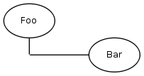
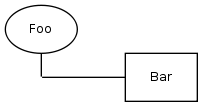

#GENERATORS

Components in the component tree are created by so called "Generators". Any Component can have such generators 
and so create child components.

The most important property of a generator is which type of item it creates and which component class it creates.

##Component Class:

The component class of an item defines how the item contents looks like and it's content. A component class can have child component items.

##Component Type:

The type of a component item defines it's role. The type does not define if there are child component items.

1. Component
Plain component with no extra role. This component usually gets embedded by others

2. Page
Component gets displayed on it's own page. Has it's own url that can also be resolved.

3. Box
Component get's displayed outside the main content in a so called box as it is defined in the [master](../customize-master.md)

4. PseudoPage
This is a not so commonly used type that doesn't have it's own url but adds a filename part to the url for it's children.

###Generator Type:

This is _how_ the generator creates children:

1. Static Generator
   Child component is statically defined (fixed)
    
2. Table Generator
    child components are created based on contents of a model. This model is editable in the backend.

3. StaticSelect Generator
    Select one of defined classes, selection is editable in the backend
    
    
#GENERATOR CLASSES

Based on the combination of Component Type (component, page, box) and Generator Type (static, table) 
the following generator classes exist:

* `Kwf_Component_Generator_Static`: plain component, static

     Settings: multiple component
        
* `Kwf_Component_Generator_Table`: plain component, table

     Settings: single component, model (defaults to childModel of component)
   
* `Kwf_Component_Generator_Page_Static`: page, static

     Settings: name, filename (optional)
    
* `Kwf_Component_Generator_Page_Table`: page, table

* `Kwf_Component_Generator_Box_Static`: box, static

* `Kwf_Component_Generator_Box_StaticSelect`: box, static select

* `Kwf_Component_Generator_PseudoPage_Static`: pseudo page, static 

     Settings: filename or name (auto-generated filename based on name)

* `Kwf_Component_Generator_PseudoPage_Table`: pseudo page, table

* `Kwf_Component_Generator_MultiBox_Static`: multi box, static

##Usage 

To use a generator in order to create child components for a component you have to add a new generator to it's settings. 

###Simple Example: static child component

In the following example we want to have a component Bar below Foo:

    class Foo_Component extends Kwc_Abstract
    {
        public static function getSettings()
        {
            $ret = parent::getSettings();
            $ret['generators']['bar'] = array(
                'class' => 'Kwf_Component_Generator_Static',
                'component' => 'Bar_Component'
            );
            return $ret;
        }
    }
    
###Example: table page generator

    class Foo_Component extends Kwc_Abstract
    {
        public static function getSettings()
        {
            $ret = parent::getSettings();
            $ret['generators']['bars'] = array(
                'class' => 'Kwf_Component_Generator_Page_Table'
                'model' => 'Foo_ChildModel',
                'component' => 'Bar_Component'
            );
            return $ret;
        }
    }