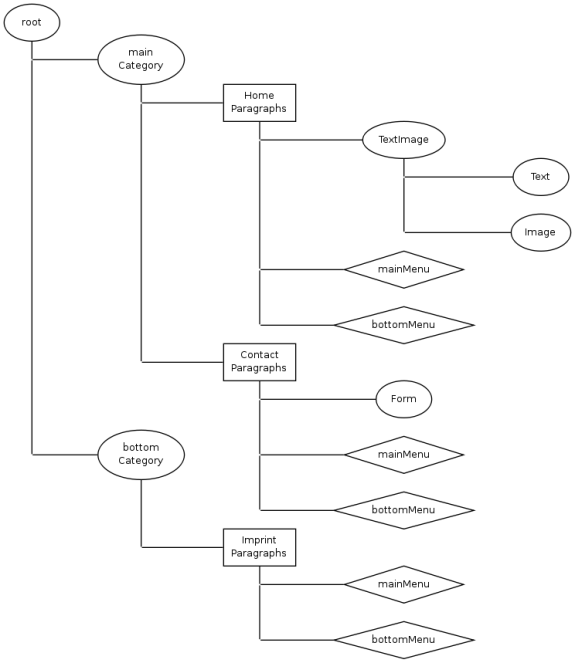

#STANDARD STRUCTURE

This is an example structure of a simple content web:

####There are 4 different types an item in the component tree can have:

* (ellipse) component (ordinary component with no special functionality)
* (box) page (component that acts as page. Has it's own url)
* (diamond) box (component that will be placed outside the page content on rendering)
* pseudo page (doesn't have own url, but adds url parts for child pages)