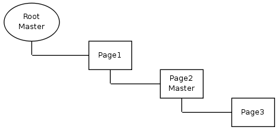

#ADD ADDITIONAL MASTER

In the example above Page1 uses the standard Master template from Root.

Page2 adds another Master template which will be used in addition to the one from Page1. That allows eg. adding an additional menu, breadcrumbs or banners.