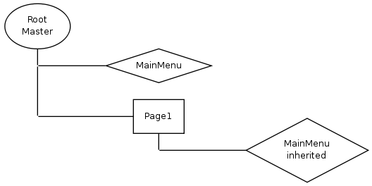

#BOX

To add non trivial content to a master you can create components as boxes and embed them in the master.

We will create the following structure:

###1. Create the Menu Component and initialize settings

    <?php
    class Menu_Main_Component extends Kwc_Menu_Component
    {
        public static function getSettings()
        {
            $ret = parent::getSettings();
            $ret['level'] = 'main';
            return $ret;
        }
    }
    
###2. Add box in Root_Component

    $ret['generators']['mainMenu'] = array(
        'class' => 'Kwf_Component_Generator_Box_Static',
        'component' => 'Menu_Main_Component',
        'inherit' => true
    );
    
    
###3. Output Box in Master.tpl

    

        <?$this->component($this->boxes['mainMenu']);?>
    

     