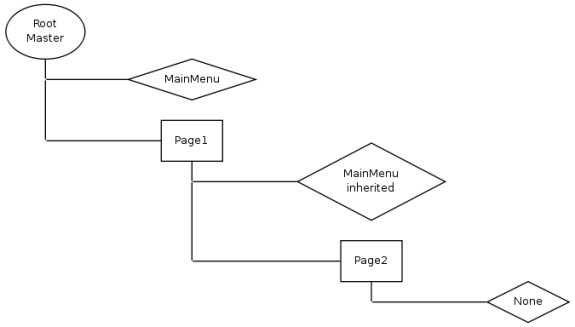

#REMOVE BOX

To clear an inherited box you can replace it by a Blank or None Box.

We will create the following structure:

###1. Create a None Box in Page2

    $ret['generators']['mainMenu'] = array(
        'class' => 'Kwf_Component_Generator_Box_Static',
        'component' => 'Kwc_Basic_None_Component'
    );
    
And that's all you have to do. Advantage of this technique is that you don't have to modify the master template.

To also hide it for child pages add `'inherit' => true`

##Hide complete box in master

To hide the complete element you can add an if:

    <? if ($this->hasContent($this->boxes['mainMenu'])) { ?>
        

            <?$this->component($this->boxes['mainMenu']);?>
        

    <? } ?>
    
    
##None vs. Blank

* `Kwc_Basic_None_Component:` The Component is "Not there", ifHasContent returns false
* `Kwc_Basic_Blank_Component:` The Component is there but is blank, ifHasContent returns true