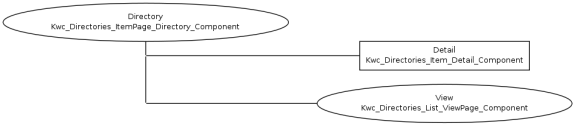
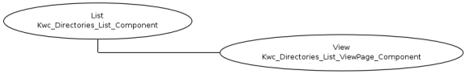

#STRUCTURE

**Directory**: owns the data (by using a Model); edits data (if required)

**List**: fetches the data from a Directory (adding additional where)

**View**: just shows data (same view class can be used several times)