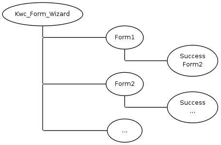

#WIZARD COMPONENT

This component is used to guide a user through separate forms.

Instead of the success-component of the first form the second form will be shown.

####Define the forms in getSettings:

      $ret['generators']['child']['component']['form1'] = 'Form2_Component';
      $ret['generators']['child']['component']['form2'] = 'Form1_Component';
      
      

An easy way to override the success component is with the getSuccessComponent function

    public function getSuccessComponent()
    {
        return $this->getData()->parent->getChildComponent('-form2');
    }