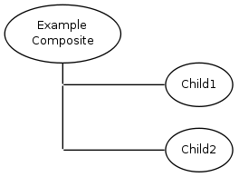

#KWC_ABSTRACT_COMPOSITE_COMPONENT

This is a base component frequently used. It embeds a static (fixed) number of (different) child components.

The default template simply shows one component after the other. This component itself can't be edited, but it embeds the defined child components.

To actually use the component it must be inherited and configured with required child components.

###Example:

    class Example_Component extends Kwc_Abstract_Composite_Component
    {
        public static function getSettings()
        {
            $ret = parent::getSettings();
            $ret['generators']['child']['component']['child1'] = 'Example_Child1_Component';
            $ret['generators']['child']['component']['child2'] = 'Example_Child2_Component';
            return $ret;
        }
    }
     
     

###Example Template:

    
cssClass?>">
        
child1:

        <?=$this->component($this->child1)?>
        
child2:

        <?=$this->component($this->child2)?>
    

    
    
###Usage Examples:

* Kwc_TextImage_Component
* Kwc_Composite_LinkImage_Component
* Kwc_Composite_TwoColumns_Component
* Kwc_SwitchDisplay_Component
* ...and many others