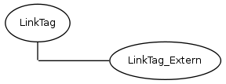

#KWC_BASIC_LINKTAG_COMPONENT

###Link vs. LinkTag

The Link component is an ordinary link, like `< a href= "/">foo< a>`

The LinkTag component however is only the first part: `< a href= "/">`

LinkTag can be used when the link content is not configurable or something else than text.

###Link type

The LinkTag_Component itself embeds one of possible child component classes.

* Kwc_Basic_LinkTag_Extern_Component (links to an external url, can be opened in popup)
* Kwc_Basic_LinkTag_Intern_Component (links to an internal page)
* Kwc_Basic_LinkTag_Mail_Component (links to an e-mail address)
* Kwc_Basic_LinkTag_News_Component (links to a news item - requires Kwc_News_Directory_Component)

###Example that configures Kwc_Basic_LinkTag_Component

(recommended usage)

add to `config.ini`:

    kwc.childComponents.Kwc_Basic_LinkTag_Component.news = Vpc_Basic_LinkTag_News_Component
    

