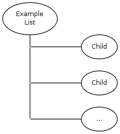

#KWC_ABSTRACT_LIST_COMPONENT

This is a base component frequently used for editable lists. It embeds a number of user defined child components - 
using always the same component class.

The default template (which is sufficient in most cases) shows all active items.

To actually use the component it must be inherited and configured with required child component.

###Example:

    class Example_Component extends Kwc_Abstract_List_Component
    {
        public static function getSettings()
        {
            $ret = parent::getSettings();
            $ret['generators']['child']['component'] = 'Example_Child_Component';
            return $ret;
        }
    }
    

###Usage Example:

* Kwc_List_Gallery_Component
* Kwc_List_Switch_Component
* Kwc_List_Fade_Component
* Kwc_Composite_Downloads_Component
* Kwc_Composite_Links_Component