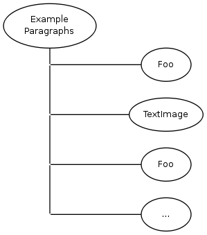

#KWC_PARAGRAPHS_COMPONENT

This is a base component frequently used for user defined contents. It creates different types of components.

The component can be used in it's default configuration, you can add additional possible child components.

###Example that creates a new component:

    class Example_Component extends Kwc_Paragraphs_Component
    {
        public static function getSettings()
        {
            $ret = parent::getSettings();
            $ret['generators']['child']['component']['textImage'] = 'Kwc_TextImage_Component';
            $ret['generators']['child']['component']['foo'] = 'Foo_Component';
            return $ret;
        }
    }
    
    
###Example that configures the Kwc_Paragraphs_Component
(recommended usage)

add to config.ini:

    kwc.childComponents.Kwc_Paragraphs_Component.textImage = Kwc_TextImage_Component
    kwc.childComponents.Kwc_Paragraphs_Component.foo = Foo_Component
    
    

