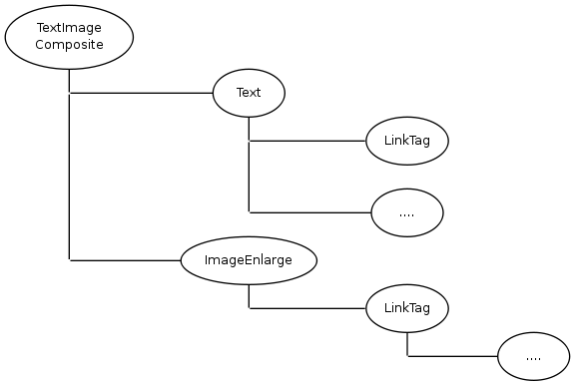

#KWC_TEXTIMAGE_COMPONENT

This is a base component frequently used for standard content. It creates a Text plus an Image right or left of the text. 
The image and the text are both optional.

Usually no configuration is required.

