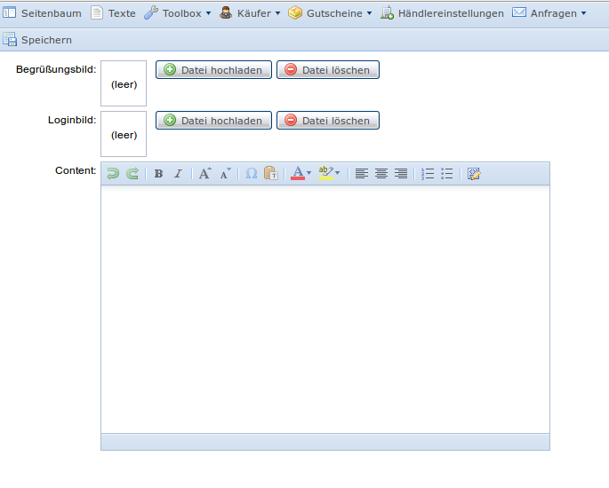

#LOGIN APPEARANCE

You can enable to configure the login dialog by adding following code to your `Acl.php`

    $this->add(new Kwf_Acl_Resource_MenuUrl('kwf_welcome_form',
                array('text'=>'Welcome', 'icon'=>'table.png'),
                '/kwf/welcome/form'), 'settings');
                
            

                
Now it's possible to set a welcom- and login-picture as well as a text.

