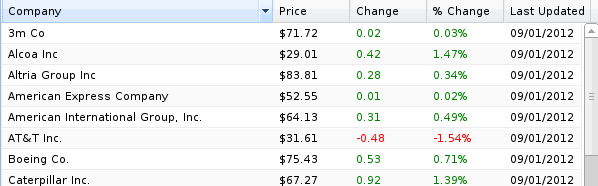

#AUTOGRID: EXISTING RENDERER

##boolean

Is working with 0 and 1:

`booleanText`: Shows yes or no

`booleanIcon`: Shows defined icon

#AUTOGRID: CUSTOM RENDERER

Using a custom renderer you can implement custom logic in JavaScript for writing out a single grid cell. 
This is basically a ExtJS feature and there are two ways to use it:

##1. Reuse a formatter

Define a formatter:

    Ext.util.Format.change = function(val) {
        if (val > 0) {
            return '' + val + '';
        } else if (val < 0) {
            return '' + val + '';
        }
        return val;
    };
    
and use it:
    
    $this->_columns->add(new Kwf_Grid_Column('change', trl('Change'), 75))
        ->setRenderer('change');
        
        
        
##2. Column config
        
    new Kwf.Auto.GridPanel({
        controllerUrl: '...',
        columnsConfig: {
            change: {
                renderer: function() {
                    if (val > 0) {
                        return '' + val + '';
                    } else if (val < 0) {
                        return '' + val + '';
                    }
                    return val;
                }
            }
        }
    });
        
See ExtJS documentation for more info on how to use [renderer](https://dev.sencha.com/deploy/ext-2.3.0/docs/?class=Ext.grid.ColumnModel#Ext.grid.ColumnModel-setRenderer).        