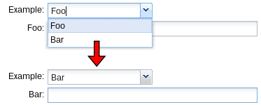

#KWF_FORM_CONTAINER_CARDS

Using Cards you can implement form fields that are only hidden/shown dependent on a value in a select field.
 
 
 
Required dependency: `KwfFormCards`       

    $cards = $this->fields->add(new Kwf_Form_Container_Cards('type', trl('Example')));
    $card = $cards->add();
    $card->setName('foo');
    $card->setTitle('Foo');
    $card->fields->add(new Kwf_Form_Field_TextField('foo_value', trl('Foo')));
     
    $card = $cards->add();
    $card->setName('bar');
    $card->setTitle('Bar');
    $card->fields->add(new Kwf_Form_Field_TextField('bar_value', trl('Bar')));
    
    
It is also possible to use a radio field instead of the select:
    
    $cards = $this->fields->add(new Kwf_Form_Container_Cards('type', trl('Example')));
    $cards->setCombobox(new Kwf_Form_Field_Radio())
    ///... continue as in above example
      
      
It is also possible to use a hidden field instead of the select, the user can not change the type himself.
      
    $cards = $this->fields->add(new Kwf_Form_Container_Cards('type', trl('Example')));
    $cards->setCombobox(new Kwf_Form_Field_Hidden())
    ///... continue as in above example