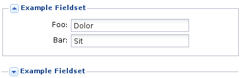
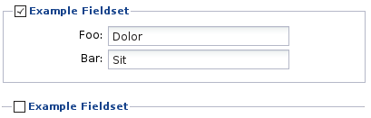

#KWF_FORM_CONTAINER_FIELDSET

A FieldSet can be used to group form elements.

    $fs = new Kwf_Form_Container_FieldSet(trl('Example Fieldset'));
    $this->fields->add($fs);
    $fs->fields->add(new Kwf_Form_Field_TextField('foo', trl('Foo')));
    $fs->fields->add(new Kwf_Form_Field_TextField('bar', trl('Bar')));
    
    
##Collapsible FieldSet

Fieldset can be collapsible to save space and hide for example advanced settings by default.

The state if a fieldset is collapsed is not stored.

    $fs->setCollapsible(true);
    $fs->setCollapsed(true); //if collapsed by default
    
##Checkbox Toggle

Fieldset can be collapsible to save space and hide for example advanced settings by default.

If the fieldset is not active it's items are not validated.

    $fs->setCheckboxToggle(true);
    $fs->setCheckboxName('has_foo'); //defines column in model where checkbox is be stored